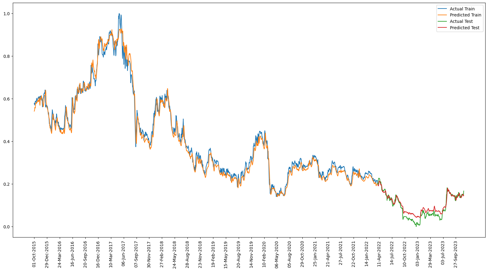

# Stock Prediction using News Info Sentiment

<b>Approach for LSTM</b> 
The dataset is structured to feed historical sequences of feature values to the LSTM model, allowing it to learn patterns over time. The LSTM model is then trained to predict the target variable (e.g., the future stock price) based on the historical information. The normalization step ensures that all values are within a consistent range, which can improve the training process for neural networks.

<b>News Integration</b> 
Wall Street reports that: Political factors that range from relations with other nations to government policies can affect share prices.
If you closely look at the headlines.json: whenever government took any initiative, shares rise. CPEC for an instance has caused alomost doubling up of stock prices in the last five years.

Zeeshan Afzal, head of research at Insight Securities says: "The phenomenal performance is linked to fast-paced GDP growth, which surged from 3.8 percent in FY2013 to 5.8 percent in FY2017, soft inflation coupled with historic low-interest rates which gave impetus to growth, industrial growth, multi-billion dollars CPEC (China-Pakistan Economic Corridor) projects and improvement in law and order situation."

<b>Algorithm</b> 
Majority of it is explained by the concept approach but what makes a difference is how to use this news info with the prediction algorithm. NLP is used to analyse the daily news titles calculating the amount of negativity, neutrality, positivity, and compound (a kind of net result).

Logic says that current news and stock data can't directly affect the next day's price as stocks move in random. But current day's news directly effect the current day's stock for example PSX grew 1140 points after Panama Verdict. Though it can be said that current information will have some effect on the next day. If we use this current information and next day's news information, it now seems logical to predict what stock price would be in the end of the day.

An implementation of this logic is used in modelling.ipynb while scrapper.ipynb and dataprep.ipynb are used to scrape news from DAWN and sentiment analysis respectively.
